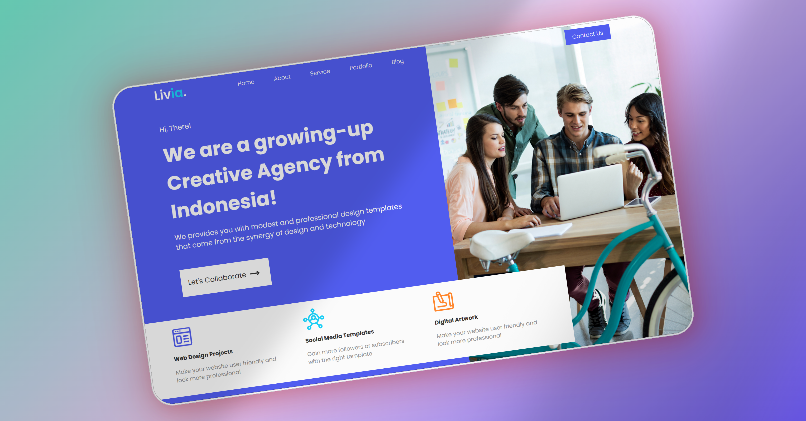

# Creative Agency Landing Page

Una landing page moderna y vibrante para una agencia creativa. Este proyecto está desarrollado con HTML y CSS como ejemplo de presentación para una agencia con enfoque en diseño web, redes sociales y arte digital.

## 📑 Tabla de Contenidos

- [Introducción](#introducción)
- [Características](#características)
- [Captura de Pantalla](#captura-de-pantalla)
- [Instalación](#instalación)
- [Uso](#uso)
- [Dependencias](#dependencias)
- [Personalización](#personalización)
- [Ejemplos](#ejemplos)
- [Contribuciones](#contribuciones)
- [Autor](#autor)
- [Licencia](#licencia)

## 🧩 Introducción

Este proyecto muestra una sección de bienvenida para una agencia creativa ficticia en Indonesia. Está orientado a presentar servicios clave de forma clara, con una estética profesional y atractiva para potenciales clientes o socios.

## ✨ Características

- Diseño limpio, moderno y responsivo
- Secciones destacadas:
  - Título y descripción impactantes
  - Llamado a la acción: "Let's Collaborate"
  - Servicios ofrecidos: diseño web, plantillas para redes sociales y arte digital
- Barra de navegación: Home, About, Service, Portfolio, Blog
- Botón destacado de contacto

## 🖼️ Captura de Pantalla



## 🚀 Instalación

1. Clona este repositorio:
```
git clone https://github.com/FrankJimenez79/creative-agency.git
```

2. Navega al directorio del proyecto:
```
cd creative-agency
```

3. Abre el archivo `index.html` en tu navegador.

## 🧪 Uso

Ideal como ejemplo de proyecto HTML/CSS para presentar servicios de agencias de diseño, marketing o desarrollo creativo.

## 📦 Dependencias

- HTML5
- CSS3
- Sin frameworks ni librerías externas

## ⚙️ Personalización

Puedes cambiar fácilmente:

- Textos en `index.html`
- Colores, tipografías y estilos en `style.css`
- Íconos e imágenes según tus necesidades

## 📚 Ejemplos

Este template puede ser extendido para landing pages de startups, agencias de medios, portafolios personales u organizaciones creativas.

## 🙌 Contribuciones

Contribuciones y sugerencias son bienvenidas. Abre un issue o haz un pull request si deseas mejorar el diseño o funcionalidad.

## 👨‍💻 Autor

Proyecto desarrollado por **Frank Jiménez** como ejemplo de landing page para agencia creativa.
